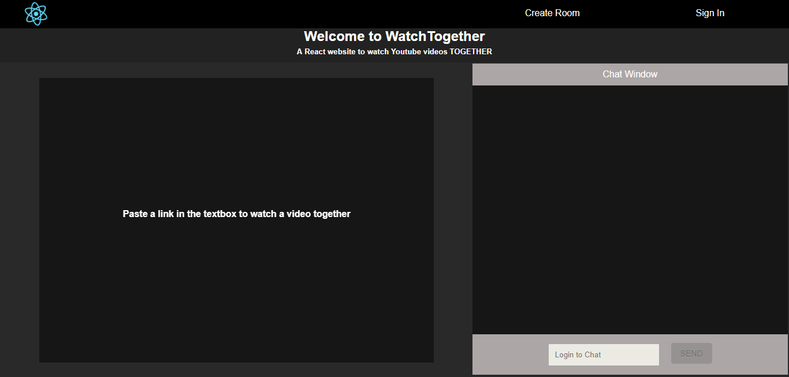

## About

A chat application built using React intended for participants to be able to view the same youtube video on their own machines.  

This project was bootstrapped with [Create React App](https://github.com/facebookincubator/create-react-app).

See it in action at [http://youtubechatapp.herokuapp.com](http://youtubechatapp.herokuapp.com)

## Overview

- The site consists of a video component and a chat component
- Signing in enables you to chat
- Pasting a youtube link in the chat box plays the youtube video for all chat participants so everyone can watch the same video together.

## Technologies
- React.js  
- Heroku (hosting)
